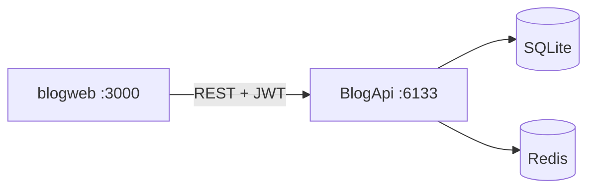

# Blog — 全栈博客项目

> ASP.NET Core 8 后端 + React 前端，JWT 认证、文章/分类/标签/嵌套评论、封面上传、Redis 缓存与完整测试体系。

**仓库**：[github.com/mrha00/Blog](https://github.com/mrha00/Blog)

## 仓库结构

| 目录 | 说明 |
|------|------|
| `BlogApi.*` | 后端 REST API（四层架构） |
| `blogweb/` | 前端 SPA（React + Vite） |
| `Scripts/` | 数据库脚本与工具 |

## 项目亮点

- **全栈闭环**：注册/登录 → 写文章 → 发布 → 评论回复 → 管理分类标签
- **分层后端**：API → Services → Infrastructure → Core
- **工程化**：统一异常处理、CoverUrl 校验、删文级联评论、分页筛选
- **测试**：Vitest 单元 + API 集成 + Playwright E2E（见 `blogweb/package.json`）
- **可部署**：Docker Compose（API + Redis），SQLite 持久化

## 技术栈

**后端**：ASP.NET Core 8 · EF Core · SQLite · JWT · Redis · Swagger · Docker  
**前端**：React 19 · TypeScript · Vite · Tailwind · React Router · Playwright

## 架构



## 快速开始（本地联调）

**环境**：.NET 8 SDK、Node.js 18+

```bash
git clone https://github.com/mrha00/Blog.git
cd Blog

# 1. 后端
copy BlogApi.API\appsettings.Development.example.json BlogApi.API\appsettings.Development.json
dotnet run --project BlogApi.API

# 2. 前端（新终端）
cd blogweb
npm install
copy .env.example .env.local
npm run dev
```

| 服务 | 地址 |
|------|------|
| 前端 | http://localhost:3000 |
| API / Swagger | http://localhost:6133/swagger |
| 健康检查 | http://localhost:6133/health |

| 演示账号 | 密码 | 角色 |
|---------|------|------|
| admin | 123456 | Admin |
| alice | 123456 | User |
| bob | 123456 | User |

可选：写入演示数据

```bash
dotnet run --project Scripts/DbExec -- BlogApi.API/blog.db Scripts/seed-test-data.sql
```

## 测试

```bash
cd blogweb
npm run test:all
```

后端 xUnit（WebApplicationFactory，无需启动 API）：

```bash
dotnet test BlogApi.API.Tests/BlogApi.API.Tests.csproj
```

（`npm run test:integration` / E2E 需后端在 6133 端口运行。）

## API 概览

| 模块 | 路径 | 说明 |
|------|------|------|
| 认证 | `/api/auth` | 注册、登录、当前用户 |
| 文章 | `/api/posts` | CRUD、发布/草稿、我的草稿 `/mine` |
| 分类 | `/api/categories` | 列表；管理需 Admin |
| 标签 | `/api/tags` | 列表/删除；创建需 Admin |
| 评论 | `/api/posts/{id}/comments` | 发表、嵌套回复 |
| 上传 | `/api/upload` | 封面（jpg/png，≤5MB，仅存 `/uploads/`） |

**CORS**：`appsettings.Development.example.json` 已包含 `http://localhost:3000`。

## Docker（仅 API，可选）

```bash
copy .env.example .env
docker compose up --build
```

## 详细文档

- 前端：[`blogweb/README.md`](blogweb/README.md)

## License

[MIT](LICENSE)
