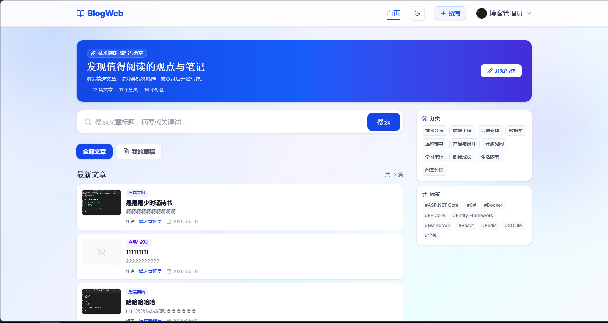
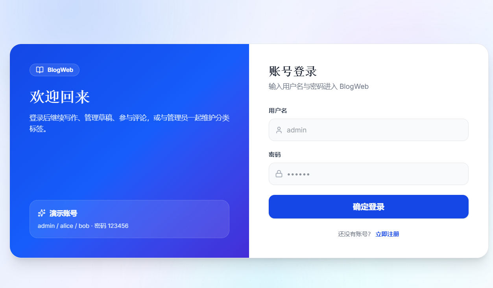
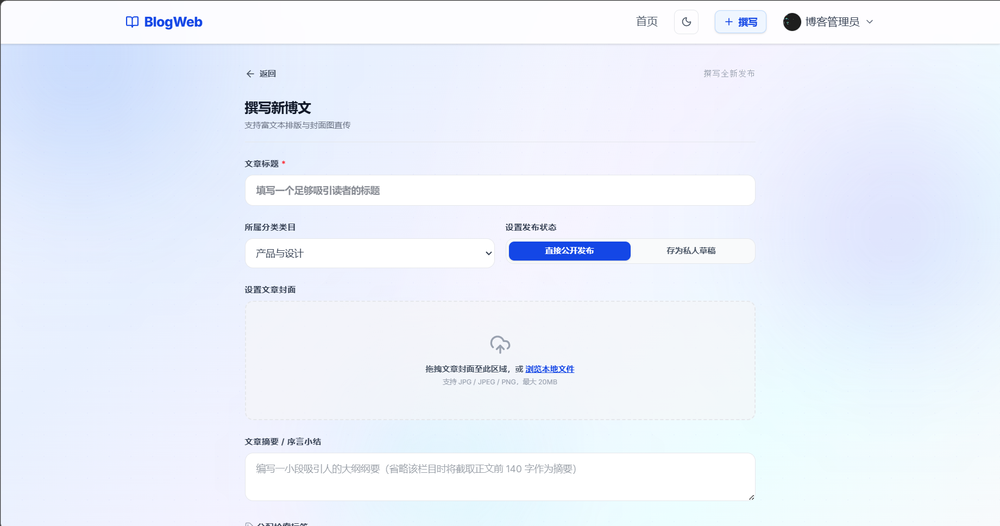
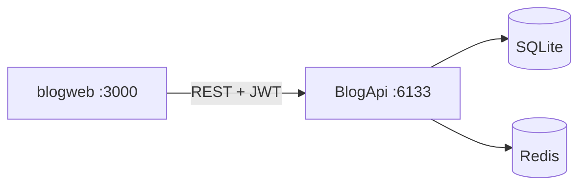

# Blog — 全栈博客系统

[](https://dotnet.microsoft.com/)
[](https://react.dev/)
[](https://www.typescriptlang.org/)
[](LICENSE)

**仓库**：[github.com/mrha00/Blog](https://github.com/mrha00/Blog)

## 项目简介

Blog 是一个**前后端分离的全栈博客平台**，覆盖读者浏览、作者创作、管理员运维三类角色。用户可注册登录、发布 Markdown 文章、上传封面、管理草稿，在文章下进行嵌套评论，并访问作者公开主页；管理员可维护分类与标签。

后端采用 **ASP.NET Core 8 四层架构**（API → Services → Infrastructure → Core），前端为 **React + Vite SPA**（`blogweb/`），通过 JWT 与 REST API 联调。项目包含单元测试、API 集成脚本、Playwright E2E 与后端 xUnit，适合作为**全栈工程化实践**的简历 / 面试展示项目。

| | |
|---|---|
| **前端** | http://localhost:3000（`blogweb/`） |
| **API / Swagger** | http://localhost:6133/swagger |
| **演示账号** | `admin` / `alice` / `bob`，密码均为 `123456` |

## 界面预览

| 首页 | 登录页 | 编辑器 |
|:---:|:---:|:---:|
|  |  |  |

## 仓库结构

| 目录 | 说明 |
|------|------|
| `BlogApi.*` | 后端 REST API（四层架构） |
| `blogweb/` | 前端 SPA（React + Vite + Tailwind） |
| `Scripts/` | 数据库脚本与工具 |
| `docs/` | 审查报告与补充文档 |

## 核心功能

**读者侧**：首页搜索 / 分类 / 标签筛选、文章详情与阅读进度、嵌套评论（扁平展示 + @ 回复）、作者公开主页  
**作者侧**：Markdown 编辑器、封面图上传（≤20MB）、草稿 / 发布、个人资料（头像 / 昵称 / 简介 / 改密）、`/profile` 跳转公开主页  
**管理侧**：分类 CRUD、标签增删改、测试数据一键清理（Admin）  
**工程能力**：JWT + Refresh Token、FluentValidation、统一 ApiResponse、Redis 列表缓存、Docker 部署、深色模式

## 项目亮点

- **全栈闭环**：注册 → 写作 → 发布 → 评论 → 用户主页 → 分类标签管理
- **分层后端**：Controller 编排、Service 业务、Repository 数据访问，DTO / Validator 边界清晰
- **用户体系**：公开资料 API（`/api/users/{id}`）、个人简介字段、列表与详情均返回封面 URL
- **前端体验**：深色模式、渐变背景、可框选复制的正文与表单、整卡点击与作者链接并存
- **测试体系**：Vitest 单元 + Node 集成脚本 + Playwright E2E + xUnit（API + Service）
- **可部署**：Docker Compose（API + Redis），SQLite 持久化

## 技术栈

**后端**：ASP.NET Core 8 · EF Core · SQLite · JWT · Redis · Swagger · Docker  
**前端**：React 19 · TypeScript · Vite · Tailwind CSS v4 · React Router · GSAP · Playwright

## 架构



## 快速开始（本地联调）

**环境**：.NET 8 SDK、Node.js 18+

```bash
git clone https://github.com/mrha00/Blog.git
cd Blog

# 1. 后端
copy BlogApi.API\appsettings.Development.example.json BlogApi.API\appsettings.Development.json
dotnet run --project BlogApi.API

# 2. 前端（新终端）
cd blogweb
npm install
copy .env.example .env.local
npm run dev
```

| 服务 | 地址 |
|------|------|
| 前端 | http://localhost:3000 |
| API / Swagger | http://localhost:6133/swagger |
| 健康检查 | http://localhost:6133/health |

| 演示账号 | 密码 | 角色 |
|---------|------|------|
| admin | 123456 | Admin |
| alice | 123456 | User |
| bob | 123456 | User |

## 测试

```bash
cd blogweb
npm run test:all
```

后端 xUnit（WebApplicationFactory，无需启动 API）：

```bash
dotnet test BlogApi.API.Tests/BlogApi.API.Tests.csproj
dotnet test BlogApi.Services.Tests/BlogApi.Services.Tests.csproj
```

（`npm run test:integration` / E2E 需后端在 6133 端口运行。）

## API 概览

| 模块 | 路径 | 说明 |
|------|------|------|
| 认证 | `/api/auth` | 注册、登录、Refresh Token、退出、个人资料、改密 |
| 用户 | `/api/users/{id}` | 公开资料、已发布文章列表 |
| 文章 | `/api/posts` | CRUD、发布/草稿、我的草稿 `/mine`（列表含 `coverUrl`） |
| 分类 | `/api/categories` | 列表；管理需 Admin；支持测试数据清理 |
| 标签 | `/api/tags` | 列表/增删改；管理需 Admin；支持测试数据清理 |
| 评论 | `/api/posts/{id}/comments` | 发表、嵌套回复 |
| 上传 | `/api/upload` | 封面/头像（jpg/png，≤20MB，仅存 `/uploads/`） |

**CORS**：`appsettings.Development.example.json` 已包含 `http://localhost:3000`。

## Docker（仅 API，可选）

```bash
copy .env.example .env
docker compose up --build
```

## 详细文档

- 前端：[`blogweb/README.md`](blogweb/README.md)
- 审查报告：[`docs/AUDIT-REPORT.md`](docs/AUDIT-REPORT.md)

## License

[MIT](LICENSE)
