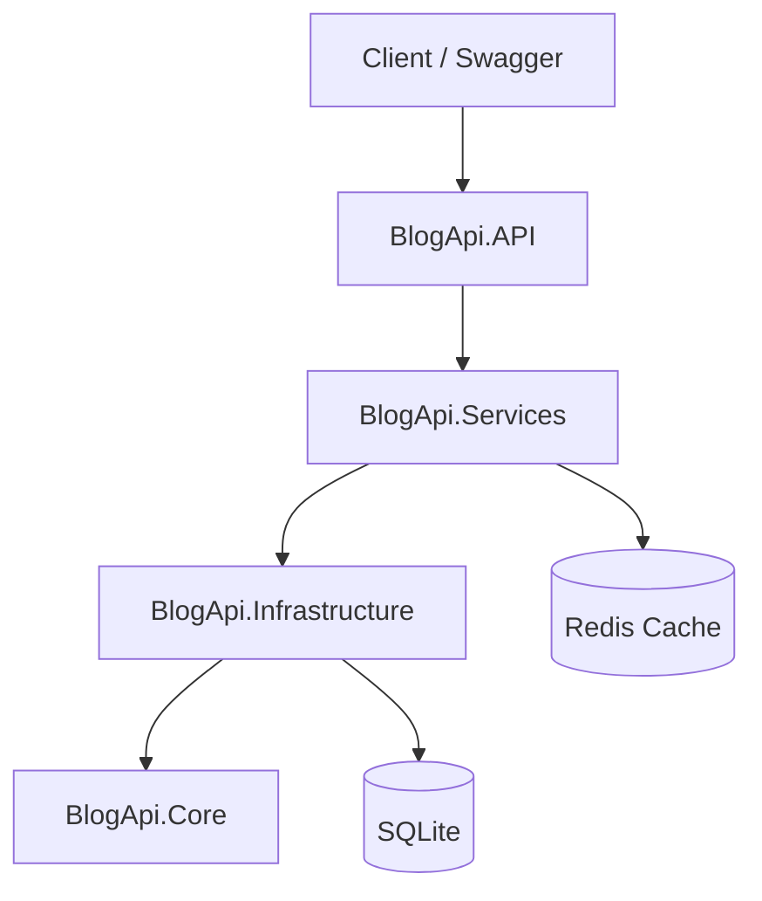

# BlogApi

> 基于 ASP.NET Core 8 的博客 REST API，采用四层架构，涵盖 JWT 认证、内容管理、评论、文件上传与 Redis 缓存。

**仓库**：[github.com/mrha00/Blog](https://github.com/mrha00/Blog)

## 项目亮点

- **分层架构**：API → Services → Infrastructure → Core，Controller 仅依赖 Service
- **完整业务闭环**：用户认证、文章 CRUD、分类/标签、嵌套评论、图片上传
- **工程化细节**：统一异常处理、分页与组合筛选、浏览量 IP 防刷、详情缓存与失效
- **可部署**：Docker Compose（API + Redis），SQLite 数据持久化

## 技术栈

`ASP.NET Core 8` · `Entity Framework Core` · `SQLite` · `JWT Bearer` · `Redis` · `Swagger` · `Docker`

## 架构



## 快速开始

**环境**：.NET 8 SDK

```bash
git clone https://github.com/mrha00/Blog.git
cd Blog

# 1. 配置 JWT（复制示例并修改 Key，至少 32 字符）
copy BlogApi.API\appsettings.Development.example.json BlogApi.API\appsettings.Development.json

# 2. 启动（自动执行数据库迁移）
dotnet run --project BlogApi.API

# 3. 可选：写入演示管理员
dotnet run --project Scripts/DbExec -- BlogApi.API/blog.db Scripts/seed-test-data.sql
```

打开 Swagger：**http://localhost:6133/swagger**

| 演示账号 | 密码 | 角色 |
|---------|------|------|
| admin | Admin123! | Admin |

也可通过 `POST /api/auth/register` 注册普通用户。

## API 概览

| 模块 | 路径 | 说明 |
|------|------|------|
| 认证 | `/api/auth` | 注册、登录、当前用户 |
| 文章 | `/api/posts` | CRUD、发布/草稿、分页与筛选 |
| 分类 | `/api/categories` | 列表；管理需 Admin |
| 标签 | `/api/tags` | 列表；管理需 Admin |
| 评论 | `/api/posts/{id}/comments` | 发表、回复、嵌套查询 |
| 上传 | `/api/upload` | 图片上传（jpg/png，≤5MB） |

在线文档：启动后访问 `/swagger`。

## Docker（可选）

```bash
copy .env.example .env   # 设置 JWT_KEY
docker compose up --build
```

- API / Swagger：<http://localhost:8080/swagger>
- 数据文件：`./data/blog.db`

## License

[MIT](LICENSE)
